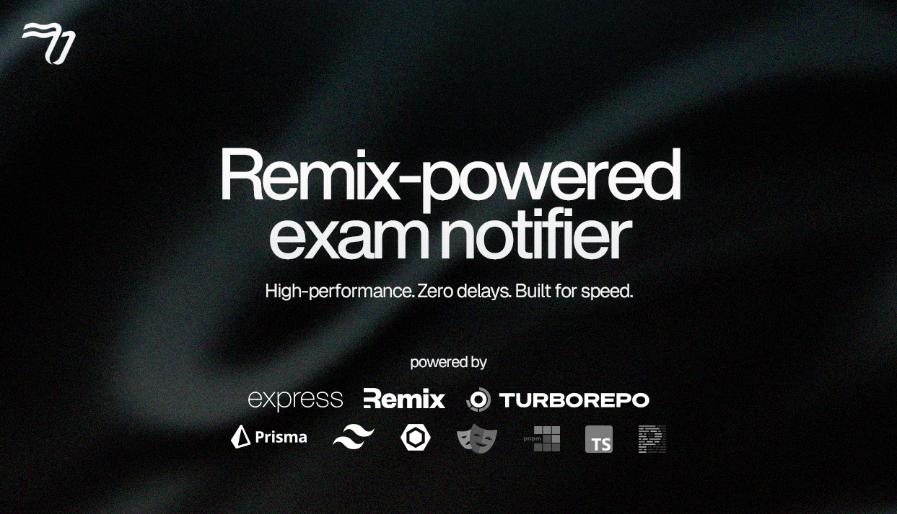

<a href="https://www.ucp.edu.ar/">
  
  <h1 align="center">Exam Notification System (currently in dev)</h1>
</a>

<p align="center">
  A high-performance notification platform for managing and distributing exam board assignments at the Universidad de la Cuenca del Plata.
</p>

<p align="center">
  <a href="https://www.ucp.edu.ar/"><strong>Read Docs</strong></a> ·
  <a href="#features"><strong>Features</strong></a> ·
  <a href="#performance"><strong>Performance</strong></a> ·
  <a href="#getting-started"><strong>Getting Started</strong></a>
</p>
<br/>

## Features

- **[Remix](https://remix.run) Fullstack Framework**
  - Server-first rendering for optimal performance and SEO
  - Progressive data loading and route-level code splitting
- **[Turborepo](https://turbo.build/repo) Monorepo Management**
  - Code sharing across apps and packages
  - Incremental builds and caching for development and CI
- **Relational Data Modeling with [PostgreSQL](https://www.postgresql.org/) and [Prisma](https://www.prisma.io)**
  - Strongly-typed schema and efficient querying of professors, subjects, careers, and exam boards
- **[Redis](https://redis.io) Integration**
  - In-memory caching for low-latency access to frequent queries (e.g., upcoming exams, assigned professors)
- **Component UI with [shadcn/ui](https://ui.shadcn.com) and [Tailwind CSS](https://tailwindcss.com)**
  - Customizable, accessible UI primitives based on Radix UI
- **Progressive Web App (PWA) Support**
  - Push notifications for professors when assigned to an exam board
- **Authentication and Role-based Access**
  - Separate access panels for administrators and professors
- **Testing Setup**
  - Unit testing with [Jest](https://jestjs.io)
  - End-to-end testing with [Playwright](https://playwright.dev)

## Performance

This system is designed with academic excellence in mind, prioritizing:

- ⚡ **High runtime performance** using Remix and Redis-based caching
- 🔍 **Excellent SEO** through server-side rendering
- 🧪 **Robust test coverage** with integrated unit and end-to-end testing
- 🚀 **Monorepo efficiency** using Turborepo for fast development and CI pipelines

## What's in the stack

This stack is a Remix oriented Monorepo powered by turborepo and [pnpm workspaces](https://pnpm.io/workspaces). Containing a ready-to-deploy Express Backend on [railway](https://railway.com/) via the building of a Docker container.

_This Package **uses `pnpm` as the package manager** of choice to manage workspaces. It may work with `yarn` and `npm` if you put the workspace definitions in the package.json file but there is no guarantee._

### Monorepo architecture powered by [Turborepo](https://turborepo.org/) and pnpm workspaces:

- `apps` Folder containing the applications
  - [`remix-app`](): the [Remix.run](https://remix.run) app in ESM.
  - [`remix-vercel`](): the [Remix.run](https://remix.run) app, ready to be deployed on [Vercel](https://vercel.com).
  - [`express-backend`](): a [Express.js](https://expressjs.com/) backend
- `packages` Folder containing examples

  - [`ui`](): a React UI package example powered by [shadcn/ui](https://ui.shadcn.com/). Some example components and shadcn/ui Tailwind config exported as Tailwind plugin and preset.
  - [`database`](): a [Prisma](https://prisma.io) wrapper ready to be used in other packages, or apps. Bundled with [tsup](https://tsup.egoist.dev/). Can be PostgreSQL or SQLite // Litefs dependening of what you choose during installation.
  - [`business`](): an example package using the Prisma `database` as a dependency and using a _repository pattern_ like example.
  - [`internal-nobuild`](): an example package that is pure TypeScript with no build steps. The `main` entrypoint to the package is directly `src/index.ts`. Remix takes care of compiling with its own build step (with esbuild). This packages also contains unit test with Vitest.
    Remix uses `tsconfig.json` paths to reference to that project and its types. _I would recommend these types of **internal** packages when you don't plan on publishing the package._

- `config-packages`:
  - Eslint packages with different preset configs.
  - TS Configs, also with different presets.
  - [Tailwind](https://tailwindcss.com/) configs.

## Getting Started

To run this project locally, make sure to configure your environment variables as defined in `.env.example`.

> ⚠️ Do not commit your `.env` file to version control. It contains secrets used for database access, session management, and notification services.

1. Clone the repository:
   ```bash
   git clone https://github.com/Santserrano/exam-notifier.git
   cd exam-notifier
   ```

## ⚠️ Turborepo dev features (parallel Express.js and Remix)
Remix -> http://localhost:3000
Express -> http://localhost:3001
Remix Vercel -> http://localhost:5173

  ```bash
  npx turbo run dev --filter=express-backend --filter=@exam-notifier/remix-app
  ```

## Development

- Install the dependencies.
  ```bash
  pnpm install
  ```
  You also have to copy the example .env.example:
  ```sh
  cp .env.example .env
  cp .env.example .env.docker
  ```

- Start the postgresql docker container

  ```bash
  pnpm run docker:db
  ```

  > **Note:** The npm script will complete while Docker sets up the container in the background. Ensure that Docker has finished and your container is running before proceeding.

- Generate prisma schema
  ```bash
  pnpm run generate
  ```
- Run the Prisma migration to the database
  ```bash
  pnpm run db:migrate:deploy
  ```
- Run the first build (with dependencies via the `...` option)
  ```bash
  pnpm run build --filter=@exam-notifier/remix-app...
  ```
  **Running simply `pnpm run build` will build everything, including the Remix, Remix-vercel and Express.js app.**
- Run the Remix dev server
  ```bash
  pnpm run dev --filter=@exam-notifier/remix-app
  ```

## Deployment with Railway

The Express backend is containerized using Docker and can be easily deployed to Railway. Here's how to set it up:

1. Create a new project on [Railway](https://railway.app)
2. Connect your GitHub repository
3. Add the following services to your project:
   - PostgreSQL database
   - Redis instance
   - Your Express backend (using the Dockerfile)

### Building and Running Docker Container Locally

- Create a docker network
  ```bash
  docker network create app_network
  ```
- Build the docker image
  ```bash
  pnpm docker:build --filter=@exam-notifier/express-backend
  ```
- Run the docker Image
  ```bash
  pnpm docker:run --filter=@exam-notifier/express-backend
  ```

## Tests, Typechecks, Lint, Install packages...

Check the `turbo.json` file to see the available pipelines.

- Lint everything
  ```bash
  pnpm run lint
  ```
- Typecheck the whole monorepo
  ```bash
  pnpm run typecheck
  ```
- Test the whole monorepo
  ```bash
  pnpm run test
  or
  pnpm run test:dev
  ```
